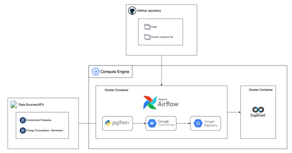
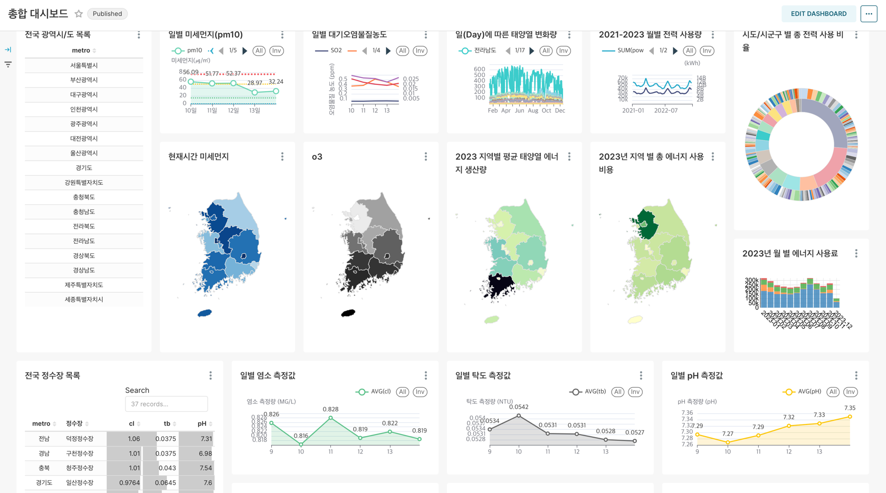
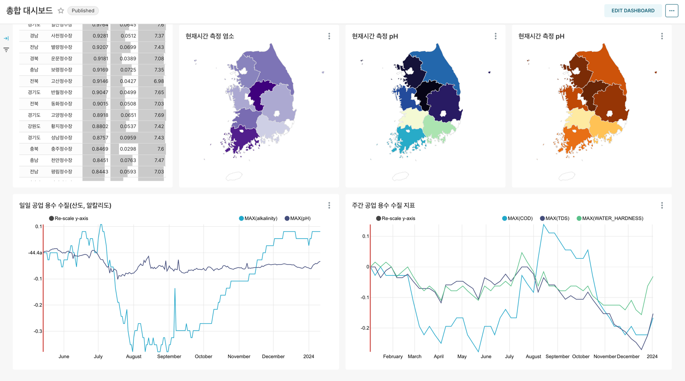

# 재생 에너지 생산∙사용 및 환경 오염 지표 대시보드
### 1. 개요
대기 및 수질 오염도, 에너지 생산 및 소비량을 다양한 지표로 알려주는 Eco 대시보드
<br>

### 2. 기능 명세
일∙주∙월간 지역별 대기질(미세먼지, 대기오염물질 농도 등), 수질(탁도, 산도, 알칼리도 등), 총 전력∙에너지 생산∙소비량을 알 수 있다.
<br>

### 3. Tech Stack & Architecture

- 데이터 파이프라인, 인프라
    - Google Cloud Compute Engine(VM)
    - Apache Airflow
    - Docker
- 데이터 수집
    - 공공 데이터 API
- 데이터 처리
    - Python
    - SQL
    - Google Cloud Storage
- 데이터 웨어하우스
    - Google BigQuery
- 데이터 시각화
    - Apache Superset
<br>

### 4. 실행 방법
root 폴더에서 다음 명령어 실행
```text
docker compose up -d
```
<br>

### 5. 대시보드 메인 화면


<br>

### 6. 개발 기간 및 역할 분배
- 기간: 2024.01.08 ~ 2024.01.14
- 참여 및 역할
    - 김원경: Github 구조 작성, 데이터 스키마 작성, ETL, ELT, 시각화
    - 윤서진: 데이터 스키마 작성, ETL, ELT, 시각화
    - 이상혁: Github Workflow 작성, ETL, ELT, 시각화
    - 이서림: Airflow, Superset 서버, GCS, BigQuery 환경 설정, 도커 파일 작성, ETL, ELT, 시각화
<br>

### 7. More Info...
- 프로젝트 보고서 및 회고 칸반 보드: https://thewayaboutme.notion.site/3-6-1-08643e2b16c84b9594542795f29a5a48?pvs=4 
